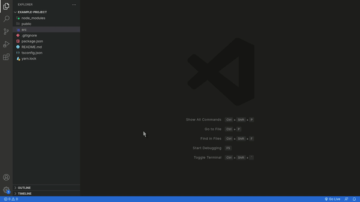

# React Component Generator

Command to create React components faster

## How to use

- Bring up the command palette and select the "Create Component" command.
- Type the name of the component
- Press [Enter] to confirm, or [Escape] to cancel.

## Features

- When you use the command it already creates the following files for your component:
    - ComponentName.tsx
    - index.tsx
    - ComponentName.test.tsx
    - styles.ts
    > The "ComponentName" is the name of the component you set

<!-- **Enjoy!** -->
